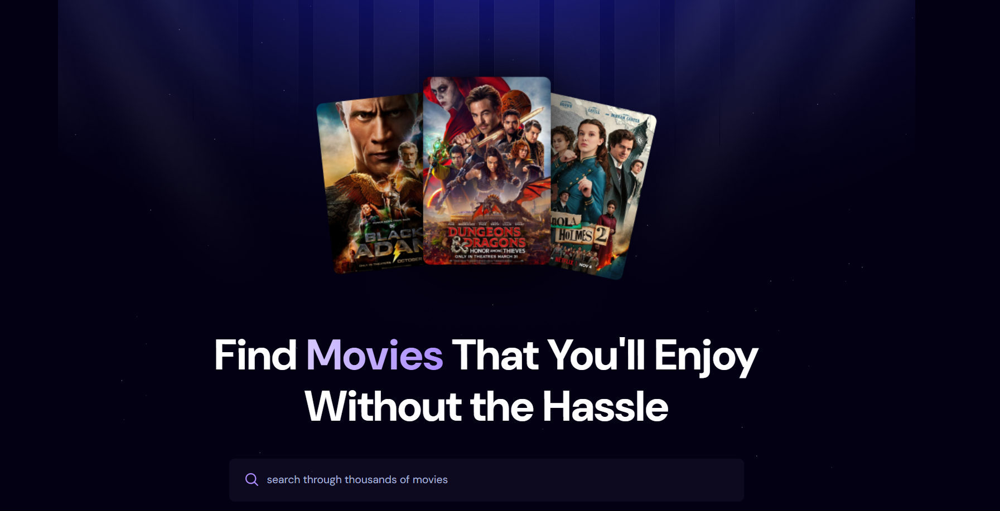
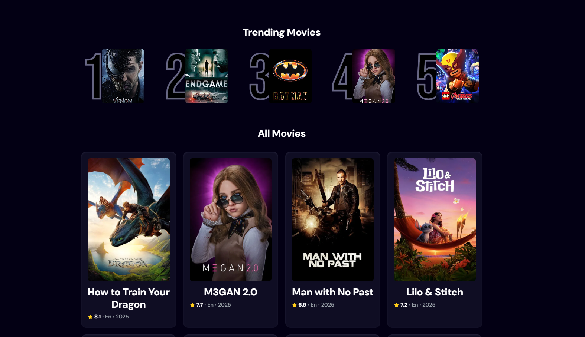
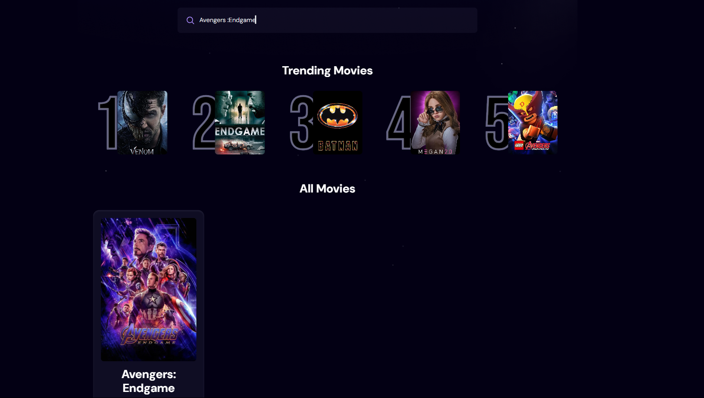
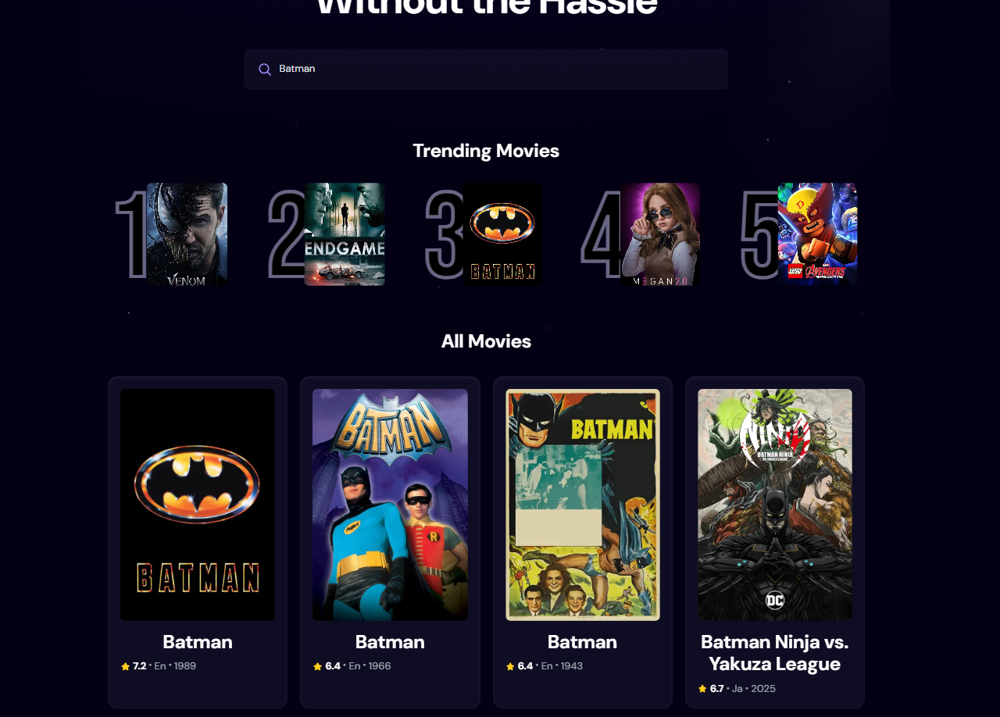

<!-- Improved compatibility of back to top link: See: https://github.com/othneildrew/Best-README-Template/pull/73 -->
<a id="readme-top"></a>

<!-- PROJECT SHIELDS -->
<!--
*** I'm using markdown "reference style" links for readability.
*** Reference links are enclosed in brackets [ ] instead of parentheses ( ).
*** See the bottom of this document for the declaration of the reference variables
*** for contributors-url, forks-url, etc. This is an optional, concise syntax you may use.
*** https://www.markdownguide.org/basic-syntax/#reference-style-links
-->

<!-- PROJECT LOGO -->
<br />
<div align="center">
  <a href="">
    
  </a>
    <br />
    <a href="">View Demo</a>
    &middot;
    <a href="">Report Bug</a>
    &middot;
    <a href="">Request Feature</a>
  </p>
</div>


<!-- TABLE OF CONTENTS -->
<details>
  <summary>Table of Contents</summary>
  <ol>
    <li>
      <a href="#about-the-project">About The Project</a>
      <ul>
        <li><a href="#built-with">Built With</a></li>
      </ul>
    </li>
    <li>
      <a href="#Getting Started">Getting Started</a>
      <ul>
        <li><a href="#prerequisites">Prerequisites</a></li>
        <li><a href="#installation">Installation</a></li>
      </ul>
    </li>
    <<li><a href="#usage">Usage</a></li>
    <li><a href="#acknowledgments">Acknowledgments</a></li>
    <li><a href="#license">License</a></li>
    <li><a href="#roadmap">Roadmap</a></li>
    <li><a href="#contributing">Contributing</a></li>
    <li><a href="#contact">Contact</a></li>
</details>


<!-- ABOUT THE PROJECT -->
# About The Project
### Screenshots of project
<div align="center">
  <a href="">
    
  </a>
    <a href="">
    
  </a>
    <a href="">
    
  </a>
    <a href="">
    
  </a>
</div>

## MovieVerse 🎬✨
### An Immersive Cinematic Journey 🍿

### MovieVerse is a dynamic and interactive movie application built with React.js and Vite. It leverages the extensive TMDB (The Movie Database) API to provide real-time movie information and introduces a unique "Trending Movies" feature powered by Appwrite, which intelligently adapts to user search behavior.

# 🌟 Features
### 🎬 Real-time Movie Data: Access up-to-date information on movies, including details, cast, trailers, and more, fetched directly from the TMDB API.

### 🔍 Optimized Search Functionality: Easily find your favorite movies with a robust search bar. The search input is powered by a custom React debounce hook to reduce unnecessary API calls and significantly improve performance.

### 📈 Dynamic Trending Movies: Discover what's currently popular! This unique feature utilizes Appwrite to track and analyze collective user search trends, providing a truly personalized and dynamic trending list.

### 🎨 Intuitive UI/UX: A clean, responsive, and user-friendly interface crafted with Tailwind CSS for a seamless Browse experience.

### 📱 Cross-Browser Compatibility: Enjoy MovieVerse flawlessly on your preferred web browser and device.

<p align="right">(<a href="#readme-top">back to top</a>)</p>


### Built With
* [![HTML][HTML5]][HTML-url]
* [![Tailwind CSS][Tailwind CSS]][Tailwind-url]
* [![JavaScript][JavaScript]][JavaScript-url]
* [![React][React.js]][React-url]
* [![Appwrite][Appwrite]][Appwrite-url]
* [![Vite][Vite]][Vite-url]
* [![TMDB][TMDB]][TMDB-url]
* [![Node.js][Node.js]][Node.js-url]
* [![npm][npm]][npm-url]


<p align="right">(<a href="#readme-top">back to top</a>)</p>


<!-- GETTING STARTED -->
# 🚀 Getting Started
Follow these steps to get a local copy of MovieVerse up and running on your machine.

### Prerequisites

This is an example of how to list things you need to use the software and how to install them.
* npm
  ```sh
  npm install npm@latest -g
  ```
* Node.js

### Installation
1. Clone the repo
   ```sh
   git clone https://github.com/Invinciblek2003/Movie_Verse.git
   cd Movie_Verse
   ```
2. Set up API Keys:
You'll need API keys for TMDB and Appwrite.

### TMDB API Key:
* Go to The Movie Database (TMDB) website and sign up for an account.
* Navigate to your account settings and request an API key (developer/v3).

### Appwrite Project Setup:
* Follow the Appwrite documentation to set up an Appwrite instance (local or cloud).
* Create a new project in your Appwrite console.
* Create a new database (e.g., movie_app_db).
* Inside the database, create a collection (e.g., search_logs) to store user search queries. Define attributes for storing the query (string) and a timestamp (datetime).
* Note down your Appwrite Endpoint, Project ID, Database ID, and Collection ID for your search_logs collection.

3. Install NPM packages
   ```sh
   npm install
   ```
4. Create a .env file:
   In the root of your project directory, create a file named .env and add your API keys and Appwrite credentials. Since this is a Vite project, use the VITE_ prefix for environment variables that need to be exposed to the client-side code:
   
   ```sh
   VITE_TMDB_API_KEY=YOUR_TMDB_API_KEY
   VITE_APPWRITE_ENDPOINT=YOUR_APPWRITE_ENDPOINT
   VITE_APPWRITE_PROJECT_ID=YOUR_APPWRITE_PROJECT_ID
   VITE_APPWRITE_COLLECTION_ID=YOUR_APPWRITE_SEARCH_LOGS_COLLECTION_ID
   VITE_APPWRITE_DATABASE_ID=YOUR_APPWRITE_MOVIE_APP_DATABASE_ID
   ```  
5. Run the development server:
   ```sh
   run npm dev
   ```
5. Change git remote url to avoid accidental pushes to base project
   ```sh
   git remote set-url origin github_username/repo_name
   git remote -v # confirm the changes
   ```

<p align="right">(<a href="#readme-top">back to top</a>)</p>


<!-- USAGE EXAMPLES -->
## Usage

### 💡 How Trending Movies Work (Appwrite Integration)
### The "Trending Movies" section in MovieVerse is dynamically generated based on user search behavior. Here's a simplified overview of the intelligent system behind it:

### Search Query Logging: 
Whenever a user performs a search, the search query is securely sent to your Appwrite backend and stored in a designated collection (e.g., search_logs).

### Frequency Analysis:
Appwrite's capabilities (or a custom function you implement within Appwrite Functions) are used to analyze these stored search queries. Queries that appear most frequently within a certain time frame are identified as "trending."

### Dynamic Display: 
The frontend then fetches these trending queries from Appwrite and uses the TMDB API to retrieve detailed information for movies matching those trending terms, displaying them to the user.

### Optimized Search with Debounce Hook 🚀
To enhance user experience and prevent excessive API calls during rapid typing, the search functionality in MovieVerse utilizes a custom React debounce hook. This hook intelligently delays the execution of the search query until a specified period of inactivity (e.g., 500ms) has passed after the last keystroke. This ensures that the search API is only called when the user has paused typing, significantly optimizing performance and reducing unnecessary network requests on both the client and server sides.

<p align="right">(<a href="#readme-top">back to top</a>)</p>

<!-- LICENSE 
## License

Distributed under the Unlicense License. See `LICENSE.txt` for more information.

<p align="right">(<a href="#readme-top">back to top</a>)</p> -->


<!-- CONTACT 
## Contact

Your Name - [@your_twitter](https://twitter.com/your_username) - email@example.com

Project Link: [https://github.com/your_username/repo_name](https://github.com/your_username/repo_name)

<p align="right">(<a href="#readme-top">back to top</a>)</p> -->


<!-- ACKNOWLEDGMENTS -->
## Acknowledgments

Use this space to list resources you find helpful and would like to give credit to. I've included a few of my favorites to kick things off!

* [Choose an Open Source License](https://choosealicense.com)
* [GitHub Emoji Cheat Sheet](https://www.webpagefx.com/tools/emoji-cheat-sheet)
* [Malven's Flexbox Cheatsheet](https://flexbox.malven.co/)
* [Malven's Grid Cheatsheet](https://grid.malven.co/)
* [Img Shields](https://shields.io)
* [GitHub Pages](https://pages.github.com)
* [Font Awesome](https://fontawesome.com)
* [React Icons](https://react-icons.github.io/react-icons/search)
* [Original README File](https://github.com/othneildrew/Best-README-Template/tree/main?tab=readme-ov-file)

<p align="right">(<a href="#readme-top">back to top</a>)</p>


<!-- MARKDOWN LINKS & IMAGES -->
<!-- https://www.markdownguide.org/basic-syntax/#reference-style-links -->
[contributors-shield]: https://img.shields.io/github/contributors/othneildrew/Best-README-Template.svg?style=for-the-badge
[contributors-url]: https://github.com/othneildrew/Best-README-Template/graphs/contributors
[forks-shield]: https://img.shields.io/github/forks/othneildrew/Best-README-Template.svg?style=for-the-badge
[forks-url]: https://github.com/othneildrew/Best-README-Template/network/members
[stars-shield]: https://img.shields.io/github/stars/othneildrew/Best-README-Template.svg?style=for-the-badge
[stars-url]: https://github.com/othneildrew/Best-README-Template/stargazers
[issues-shield]: https://img.shields.io/github/issues/othneildrew/Best-README-Template.svg?style=for-the-badge
[issues-url]: https://github.com/othneildrew/Best-README-Template/issues
[license-shield]: https://img.shields.io/github/license/othneildrew/Best-README-Template.svg?style=for-the-badge
[license-url]: https://github.com/othneildrew/Best-README-Template/blob/master/LICENSE.txt
[linkedin-shield]: https://img.shields.io/badge/-LinkedIn-black.svg?style=for-the-badge&logo=linkedin&colorB=555
[linkedin-url]: https://linkedin.com/in/othneildrew
[product-screenshot]: Screenshots/Img-1.png
[product-screenshot2]: Screenshots/Img-2.png
[product-screenshot3]: Screenshots/Img-3.png
[product-screenshot4]: Screenshots/Img-4.png
[Next.js]: https://img.shields.io/badge/next.js-000000?style=for-the-badge&logo=nextdotjs&logoColor=white
[Next-url]: https://nextjs.org/
[React.js]: https://img.shields.io/badge/React-20232A?style=for-the-badge&logo=react&logoColor=61DAFB
[React-url]: https://reactjs.org/
[Vue.js]: https://img.shields.io/badge/Vue.js-35495E?style=for-the-badge&logo=vuedotjs&logoColor=4FC08D
[Vue-url]: https://vuejs.org/
[Angular.io]: https://img.shields.io/badge/Angular-DD0031?style=for-the-badge&logo=angular&logoColor=white
[Angular-url]: https://angular.io/
[Svelte.dev]: https://img.shields.io/badge/Svelte-4A4A55?style=for-the-badge&logo=svelte&logoColor=FF3E00
[Svelte-url]: https://svelte.dev/
[Laravel.com]: https://img.shields.io/badge/Laravel-FF2D20?style=for-the-badge&logo=laravel&logoColor=white
[Laravel-url]: https://laravel.com
[Bootstrap.com]: https://img.shields.io/badge/Bootstrap-563D7C?style=for-the-badge&logo=bootstrap&logoColor=white
[Bootstrap-url]: https://getbootstrap.com
[JQuery.com]: https://img.shields.io/badge/jQuery-0769AD?style=for-the-badge&logo=jquery&logoColor=white
[JQuery-url]: https://jquery.com 
[HTML5]: https://img.shields.io/badge/HTML5-E34F26?style=for-the-badge&logo=html5&logoColor=white
[HTML-url]: https://developer.mozilla.org/en-US/docs/Glossary/HTML5
[Tailwind CSS]: https://img.shields.io/badge/Tailwind_CSS-38B2AC?style=for-the-badge&logo=tailwind-css&logoColor=white
[Tailwind-url]: https://tailwindcss.com/
[JavaScript]: https://img.shields.io/badge/JavaScript-F7DF1E?logo=JavaScript&logoColor=000&style=flat-square
[JavaScript-url]: https://developer.mozilla.org/en-US/docs/Web/JavaScript
[Appwrite]: https://img.shields.io/badge/Appwrite-FD366E?style=for-the-badge&logo=appwrite&logoColor=white
[Appwrite-url]: https://appwrite.io/docs
[Vite]: https://img.shields.io/badge/Vite-646CFF?style=for-the-badge&logo=vite&logoColor=white
[Vite-url]: https://vite.dev/guide/
[TMDB]: https://img.shields.io/badge/TMDB-032541?style=for-the-badge&logo=themoviedb&logoColor=01D277
[TMDB-url]: https://developer.themoviedb.org/reference/intro/getting-started
[Node.js]: https://img.shields.io/badge/Node.js-339933?style=for-the-badge&logo=nodedotjs&logoColor=white
[Node.js-url]: https://nodejs.org/docs/latest/api/documentation.html
[npm]: https://img.shields.io/badge/npm-CB3837?style=for-the-badge&logo=npm&logoColor=white
[npm-url]: https://docs.npmjs.com/
